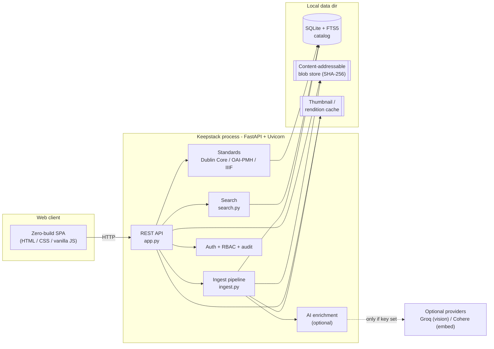
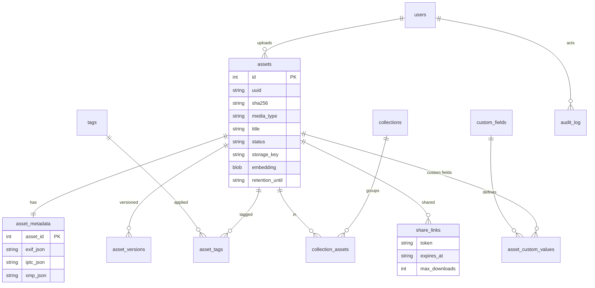
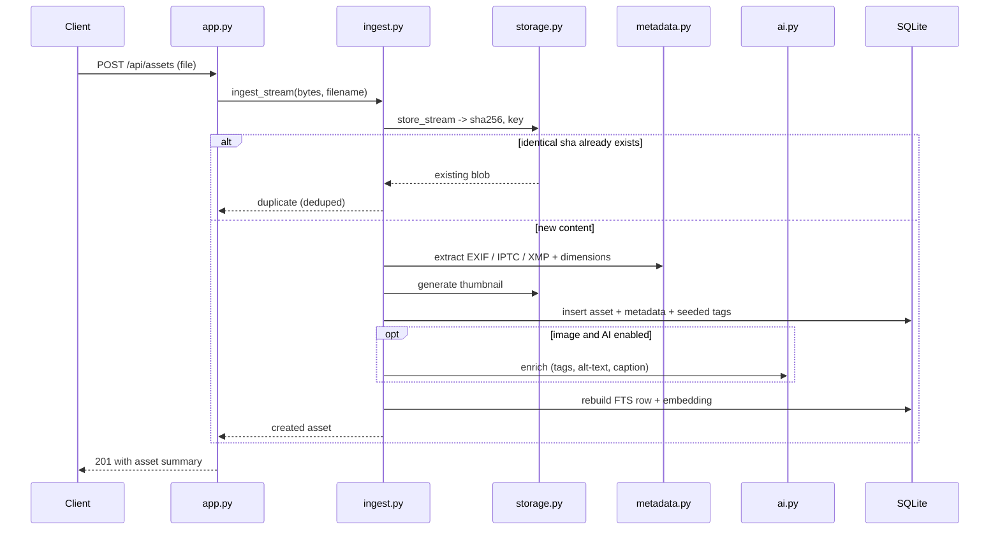
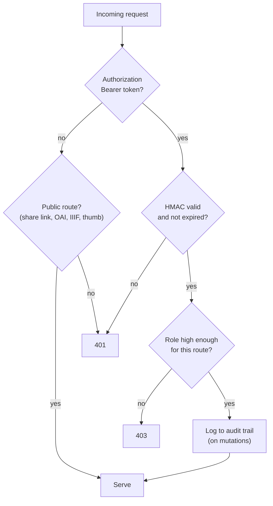

# Architecture

Keepstack is a single Python package that serves both a REST API and a zero-build
web client. It is deliberately small: one process, one SQLite database, one blob
directory, four runtime dependencies. This document explains how the pieces fit,
with diagrams that render directly on GitHub.

For the reasoning behind the big choices, see the decision records in
[docs/decisions/](docs/decisions/).

## System at a glance

Everything inside the server is stdlib except FastAPI/Uvicorn (HTTP) and Pillow
(images). No message queue, no cache server, no external database.

## Module responsibilities

| Module | Responsibility |
|--------|----------------|
| `config.py` | Environment-driven settings with safe local defaults |
| `db.py` | SQLite connection, schema, and the FTS5 full-text index |
| `storage.py` | Content-addressable blob store: dedup, fixity, retrieval |
| `metadata.py` | EXIF / IPTC / XMP extraction and descriptive-field seeding |
| `thumbnails.py` | Thumbnails and on-the-fly resized renditions (cached) |
| `ai.py` | Optional enrichment: tagging, captions, embeddings, with local fallbacks |
| `ingest.py` | The upload pipeline that ties storage, metadata, AI, and indexing together |
| `search.py` | Keyword (FTS5), faceted, and semantic (embedding) search |
| `auth.py` | scrypt passwords, stateless HMAC tokens, role hierarchy |
| `audit.py` | Append-only audit logging |
| `standards.py` | Dublin Core, OAI-PMH 2.0, IIIF Image API |
| `app.py` | FastAPI routes for every resource, and the static client mount |

## Data model

An `asset_fts` FTS5 virtual table mirrors the searchable text (title,
description, tags, metadata) and is kept in sync by the ingest pipeline.

## The ingest pipeline

The most important flow in the system. One function, `ingest_stream`, runs the
full intake so an asset is findable the moment it lands.

## Request and auth flow

Tokens are stateless HMAC payloads signed with a server secret (a minimal
JWT-style scheme on the standard library), so there is no session store and no
crypto dependency.

## Why it is shaped this way

- **One process, one file.** SQLite plus a blob directory means the entire
  repository is portable and needs no separate database to run or back up. See
  [ADR-0001](docs/decisions/ADR-0001-sqlite-over-a-database-server.md).
- **Hash-keyed storage.** Deduplication and preservation fixity are the same
  mechanism. See [ADR-0002](docs/decisions/ADR-0002-content-addressable-storage.md).
- **Optional AI, never required.** The pipeline calls a provider only if a key
  is set, and falls back to deterministic local logic otherwise. See
  [ADR-0004](docs/decisions/ADR-0004-optional-offline-ai.md).

## Scaling notes and current limits

Honest boundaries of the current design:

- SQLite in WAL mode handles the read-heavy, modest-write profile of a
  self-hosted DAM well into the hundreds of thousands of assets. Very high
  write concurrency would eventually want Postgres, which the storage and query
  layers are structured to allow later.
- Semantic search currently loads candidate embeddings and ranks in Python.
  That is fine for tens of thousands of assets; beyond that it wants an ANN
  index (for example sqlite-vec or a pgvector backend). Tracked in
  [ROADMAP.md](ROADMAP.md).
- Thumbnailing is synchronous in the request for now. Large video and document
  rendering would move to a background worker.
