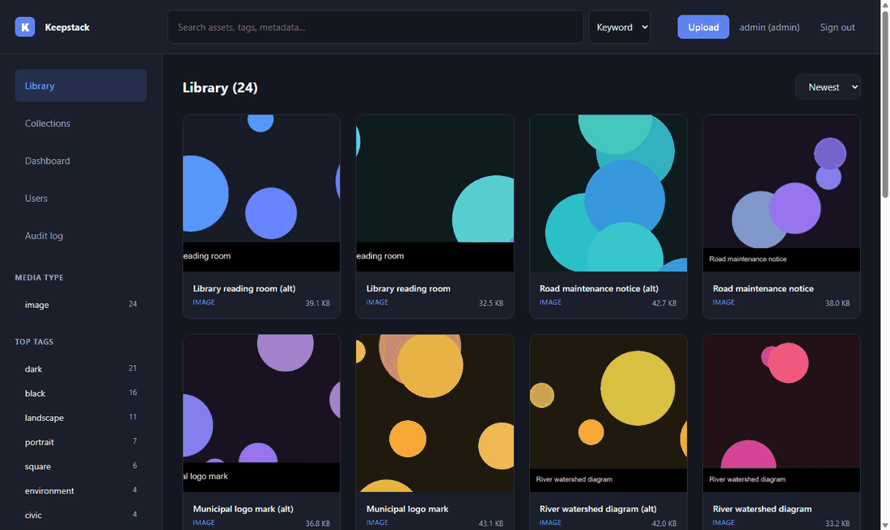
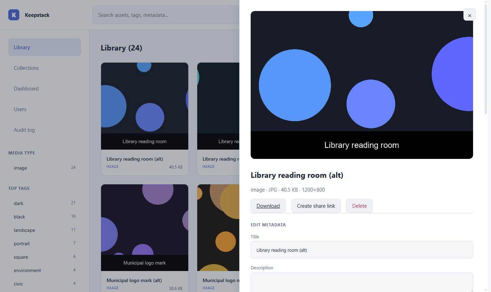
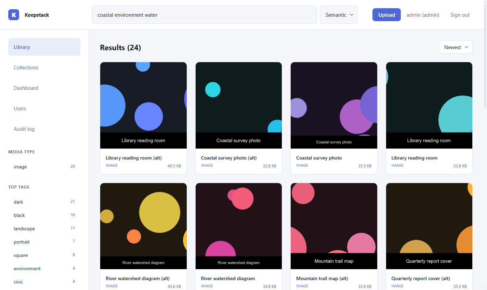
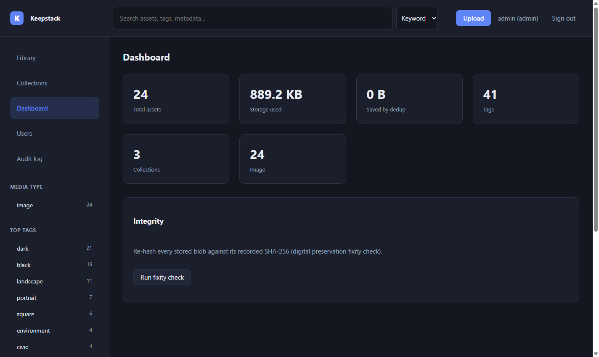

<div align="center">

# Keepstack

**A free, open-source, AI-native digital asset management system, built to archival and government-grade standards.**

[](https://github.com/exekyute/keepstack/actions/workflows/ci.yml)
[](LICENSE)




</div>

Keepstack manages images, video, audio, and documents the way a national archive
would want, and searches them the way a modern product would. It sits in a gap
no open-source tool currently fills: the heritage and preservation systems have
deep metadata standards but archaic interfaces and no AI, while the slick AI
photo libraries have no archival standards at all. Keepstack has both, plus an
install that takes one command.

## Start here

Pick your path. You do not need to read everything.

- **I want to run it** → the [60-second quickstart](#quickstart) below.
- **I want the reasoning** → [CASE-STUDY.md](CASE-STUDY.md): the market, the gap,
  and the decisions behind Keepstack.
- **I want to understand the code** → [ARCHITECTURE.md](ARCHITECTURE.md), with
  diagrams that render right here on GitHub.
- **I am new to this domain** → the [DAM-101 primer](docs/DAM-101.md).

## The problem, in three sentences

The digital asset management market splits into two camps that never met.
Standards-rich archival tools (DSpace, Archivematica, Preservica) have deep
metadata and preservation but hard installs, dated interfaces, and no AI, while
modern AI photo libraries (Immich, PhotoPrism) have great search and UX but no
Dublin Core, no OAI-PMH, and no IIIF. Keepstack is built to occupy the empty
intersection: archival standards, plus modern local AI, plus a clean interface,
free and self-hostable in one command.

The full study of the top 20 systems is in [RESEARCH.md](RESEARCH.md), and a
head-to-head capability matrix (graded against the source, audited for
overclaiming) is in [COMPARISON.md](COMPARISON.md).

## What it does

<table>
<tr><td valign="top" width="50%">

**Ingest and storage**
- Bulk drag-and-drop for images, video, audio, documents
- Content-addressable storage: identical files stored once
- SHA-256 fixity for verifiable integrity
- Full version history per asset

**Metadata and standards**
- EXIF, IPTC, and XMP extracted on upload
- Dublin Core mapping for every asset
- Alt-text as a first-class field, AI-suggested
- Rights, license, credit, and retention fields

</td><td valign="top" width="50%">

**Search and discovery**
- Full-text (SQLite FTS5), faceted, and semantic search
- "More like this" via embeddings
- Hierarchical collections

**Governance and sharing**
- Four roles, audit log on every change
- Expiring, download-limited public share links
- One-click repository fixity check

**Open endpoints (no lock-in)**
- OAI-PMH 2.0 harvesting, IIIF Image API
- A clean REST API for everything

</td></tr>
</table>

## Quickstart

Keepstack needs Python 3.10 or newer. Everything else (auth, tokens, standards
endpoints) is standard library, so the runtime dependency list is four packages.

```bash
git clone https://github.com/exekyute/keepstack.git
cd keepstack
python -m pip install -r requirements.txt
python -m keepstack seed      # optional: generate a synthetic demo catalog
python -m keepstack           # start the server on http://localhost:8000
```

Then open http://localhost:8000 and sign in as **admin** / **admin**. Prefer
containers? `docker compose up` does the same thing.

## Screenshots

| Asset detail | Semantic search | Dashboard |
|---|---|---|
|  |  |  |

<details>
<summary><b>Open standards and endpoints</b></summary>

Every asset is reachable through open, interoperable standards, so your catalog
is discoverable and your data is never trapped.

| Endpoint | Standard |
|----------|----------|
| `GET /oai` | OAI-PMH 2.0 metadata harvesting (oai_dc) |
| `GET /iiif/3/{uuid}/info.json` | IIIF Image API 3.0 |
| `GET /api/assets/{uuid}` (includes `dublin_core`) | Dublin Core |
| `GET /api/...` | Full REST API for every resource |

</details>

<details>
<summary><b>Configuration</b></summary>

All configuration is environment-driven with safe local defaults.

| Variable | Default | Purpose |
|----------|---------|---------|
| `KEEPSTACK_DATA_DIR` | `data` | Where the SQLite database and blobs live |
| `KEEPSTACK_SECRET_KEY` | generated | Token signing key (set this in production) |
| `KEEPSTACK_ADMIN_USER` / `KEEPSTACK_ADMIN_PASSWORD` | `admin` / `admin` | Bootstrap admin, created once |
| `KEEPSTACK_PORT` | `8000` | HTTP port |
| `KEEPSTACK_AI_ENABLED` | `false` | Turn on provider-backed AI |
| `GROQ_API_KEY` | unset | Optional: vision tagging / captioning / alt-text |
| `COHERE_API_KEY` | unset | Optional: higher-quality semantic embeddings |

With no AI keys, Keepstack is fully functional using deterministic local fallbacks,
and upgrades in quality when you add a key. See
[ADR-0004](docs/decisions/ADR-0004-optional-offline-ai.md).

</details>

<details>
<summary><b>Roles</b></summary>

| Role | Can do |
|------|--------|
| **viewer** | Browse, search, view, download |
| **contributor** | Plus upload, edit metadata, tag, create collections and share links |
| **editor** | Plus delete assets and manage versions |
| **admin** | Plus user management, audit log, custom fields, fixity checks |

The seed script also creates `curator` (editor), `contributor`, and `viewer`
demo accounts, password `demo1234`.

</details>

## Testing

```bash
cd keepstack
python -m pip install pytest
python -m pytest -q
```

The suite covers the ingest pipeline, content deduplication, full-text and
semantic search, fixity detection of corruption, and the Dublin Core / OAI-PMH
output.

## Documentation map

| Document | What it is |
|----------|------------|
| [CASE-STUDY.md](CASE-STUDY.md) | The narrative: market, gap, decisions, results, honest assessment |
| [RESEARCH.md](RESEARCH.md) | The top-20 market study, government-focused, citation-backed |
| [COMPARISON.md](COMPARISON.md) | Head-to-head capability matrix vs seven leading systems |
| [ARCHITECTURE.md](ARCHITECTURE.md) | How the code fits together, with diagrams |
| [docs/DAM-101.md](docs/DAM-101.md) | A primer on DAM concepts and standards |
| [docs/decisions/](docs/decisions/) | Architecture decision records |
| [DEVLOG.md](DEVLOG.md) | Build notes in the order they happened |
| [ROADMAP.md](ROADMAP.md) | Shipped vs planned |
| [CONTRIBUTING.md](CONTRIBUTING.md) / [SECURITY.md](SECURITY.md) | For builders |

## License

MIT. Copyright (c) 2026 Kevin Yu ([github.com/exekyute](https://github.com/exekyute)).
See [LICENSE](LICENSE).
